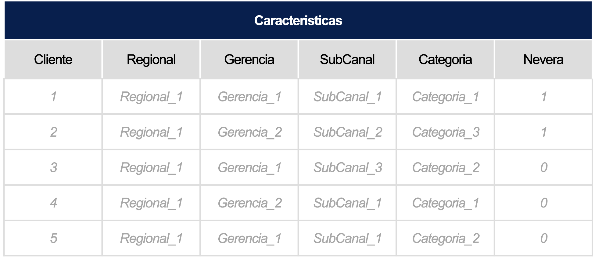
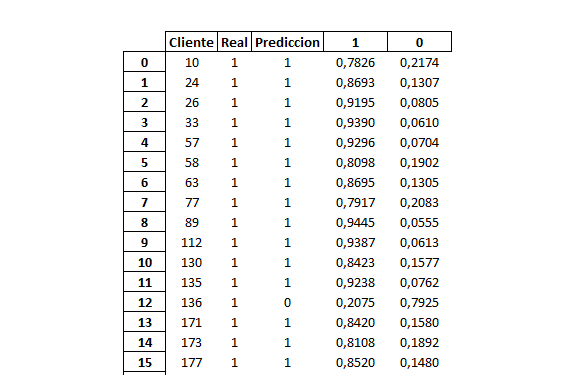

# Reto Colombia

En Bavaria quieren encontrar la mejor estrategia de impulso, mantenimiento o frenado, de un listado de marcas establecido, con el objetivo de ofrecer el mejor portafolio a los puntos de venta/zonas dependiendo de sus características e historial de compra.​

## ¿Qué construir?

El objetivo es encontrar la probabilidad de que un cliente compre cada una de las marcas dadas, con el fin de asignar la estrategia adecuada a cada uno de ellos.​

Para esto se creará un modelo que estimé dicha probabilidad para cada una de las 5 marcas que se van a listar.​




## Instrucciones:

Nuestro modelo es muy sencillo de entender y además está explicado para dummies 🤓!

\

1. En el repositorio [ver link](https://github.com/Santiago-Porras/Bavaria_Colombia) hay un notebook en la siguiente ruta:


```
# Bavaria_Colombia/data/01_MODELO.ipynb
```
\
2. Todas las fuentes están alojadas en un solo repositorio Git Hub, así que no se deben agregar más fuentes ni conexiones 👍👍

\

3. Ejecútalas y a continuación estarán descritos uno a uno los pasos para el análisis y los conceptos utilizados junto con cada uno de los algoritmos y las pruebas.

\

4. 🎁 Por último se carga la base limpia y se hace la predicción para el mes de Octubre que es lo requerido y finalmente la exportas en excel bajo el nombre **PrediccionesOctubre.xlsx**

\

5. 💰 Estas predicciones ya nos brindarán información confiable de la predicción de compra de los clientes para el mes siguiente, en este caso, octubre.

\

6. 🧐 En referencia a las validaciones, hay un notebook en el repositorio [ver link](https://github.com/Santiago-Porras/Bavaria_Colombia) con el siguiente nombre:

```
# Bavaria_Colombia/data/02_VALIDACIONES.ipynb
```


## Explicación Datasets

**BaseConsolidada.csv** = Tabla de clientes con las características de su punto de venta, ubicación e histórico de compra

- Cliente	: Id del Establecimiento (Llave primaria)
- Regional2: Región donde se encuentra ubicado (Conjunto de departamentos)
- Gerencia2: Gerencia que le distribuye el producto (Conjunto de 1, 2 o mas ciudades)	
- SubCanal2: Tipo de establecimiento: (Tienda, Bar, etc)	
- Categoria: Variable definida por AB-Inbev para calificar la importancia de un establecimiento dada su compra histórica. 	
- Nevera: Variable dummie que me permite ver si el establecimiento tiene o no una nevera en su punto de venta.
- Año: Año en el que se realiza la compra
- Mes: Mes en el que se realiza la compra
- Cliente: Id del establecimiento
- SegmentoPrecio2: Categoría de la marca, dado el ingreso por litro a la compañía.
- Marca2: Marca vendida
- Cupo2: Tipo de envase de la marca vendida
- CapacidadEnvase2: Capacidad en volumen, de la Marca2-Cupo2 vendido.
- Volumen: Cantidad de volumen vendido de la Marca-Cupo2-CapacidadEnvase2
- disc: Descuentos otorgados al establecimiento por la compra
- nr: NetRevenue que dejó la venta a la compañía.


## ¿Cuáles son los entregables?

1. El output requerido completo.
2. El modelo aplicado,  consideraciones y resultados obtenidos.​

## Formato del entregable:

- Se debe entregar un csv o xlsx bajo la siguiente estructura: Evidenciando la probabilidad de compra por cada cliente para el siguiente mes.


## Resultados del modelo:

- Una vez entrenado y validado el modelo, este fue el resulado de las predicciones junto con su validación:
- Se encuentra en este mismo repositorio, en la ruta: Bavaria_Colombia\data\Validacion_ProbPredic_Para_Septiembre.xlsx




Gracias !

Estos son nuestros datos para que nos contactes:

---
* Santiago Porras Ceferino
* santiago.porras@udea.edu.co
* +57 321 356 2739
---
* Sergio Espinal Patiño
* sergio.espinal@udea.edu.co
* +57 311 311 5213
